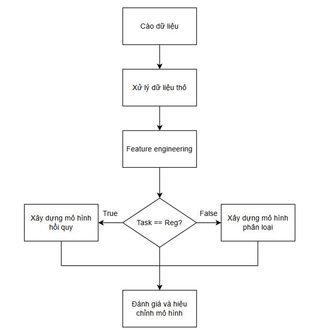

# Price prediction and hotel room classification in Danang

## Overview

Nowadays, with the development of the tourism industry in the city, the number of tourists visiting is increasing, leading to a growing demand for hotels. Along with that, the number of hotels in the city is also increasing to meet the rapidly expanding market. However, setting appropriate prices that match the quality of hotels and targeting the right customers is not an easy task for investors.

To address this issue, our team has applied the knowledge learned from the Data Science course to build models for predicting prices and classifying room categories using data collected from the famous travel website Booking.com.

Our team's solution is illustrated in the block diagram below:

*Figure 1: Program Pipelines*

1. Tree folder
    - clean data
        + clean_data_train.csv: Data after cleaning for training
        + clean_data_test.csv: Data after cleaning for testing
    - raw data
        + raw_data_train: Raw data from crawling for training
        + raw_data_testing: Raw data from crawling for testing
    - code
        + crawl.py: Data crawler
        + EDA.ipynb: EDA the collected data
        + regression.ipynb: Feature engineering and modeling for regression task
        + classification.ipynb: Feature engineering and modeling for classification task
2. Requirements
    - pandas
    - numpy
    - matplotlib
    - seaborn
    - plotly
    - scikit-learn
    - requests
    - selenium
    - BeautifulSoup4
    - unidecode
    - csv
    - warnings
3. Running instruction
    - crawl.py
        + run code
    - EDA.ipynb
        + press run all
    - regression.ipynb
        + press run all4
    - classification.ipynb
        + press run all